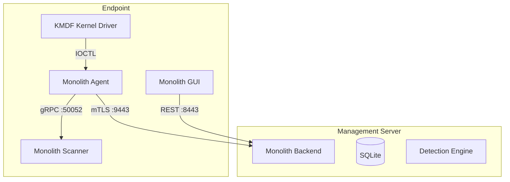
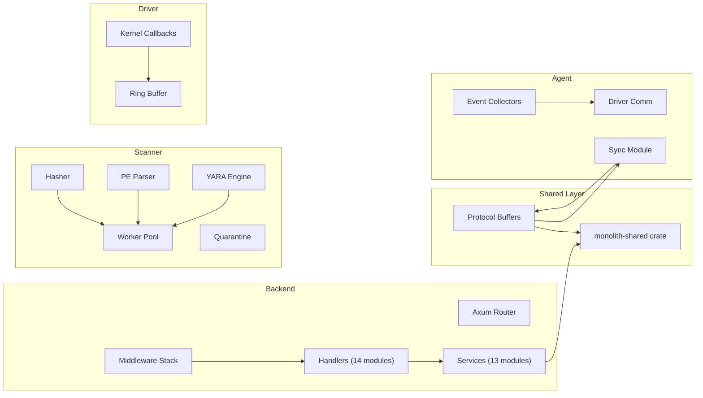
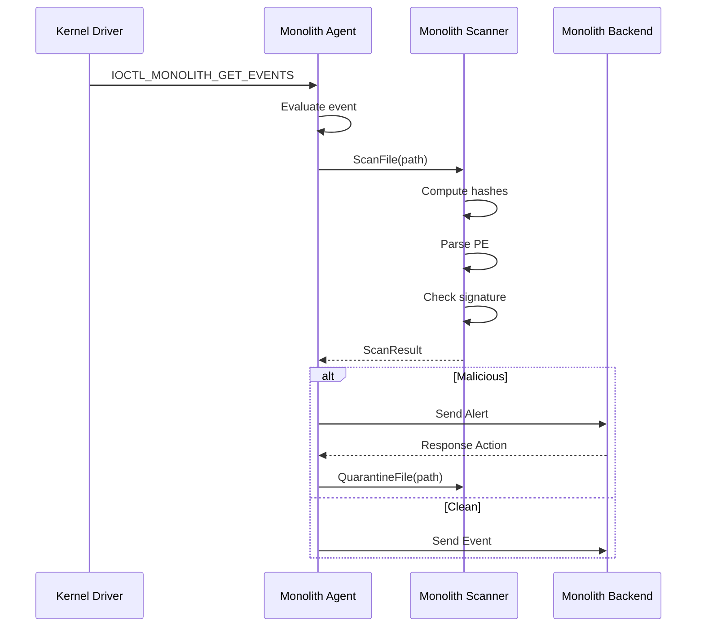
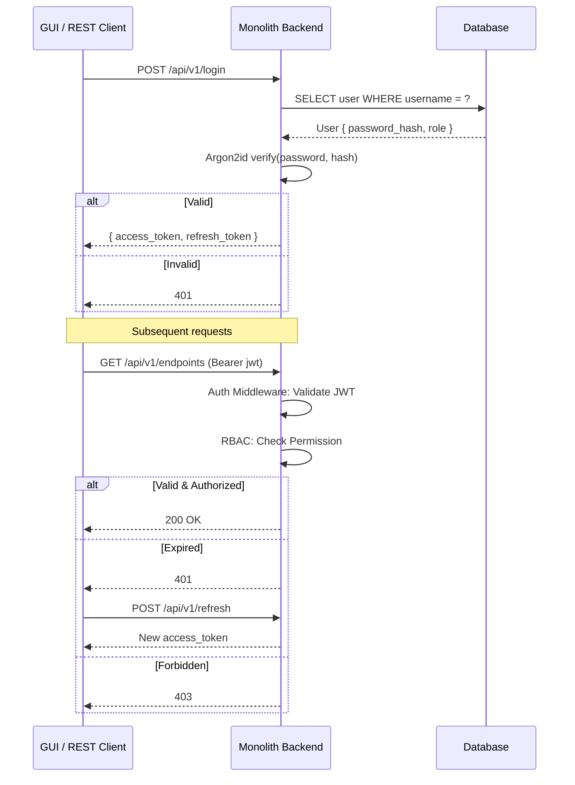
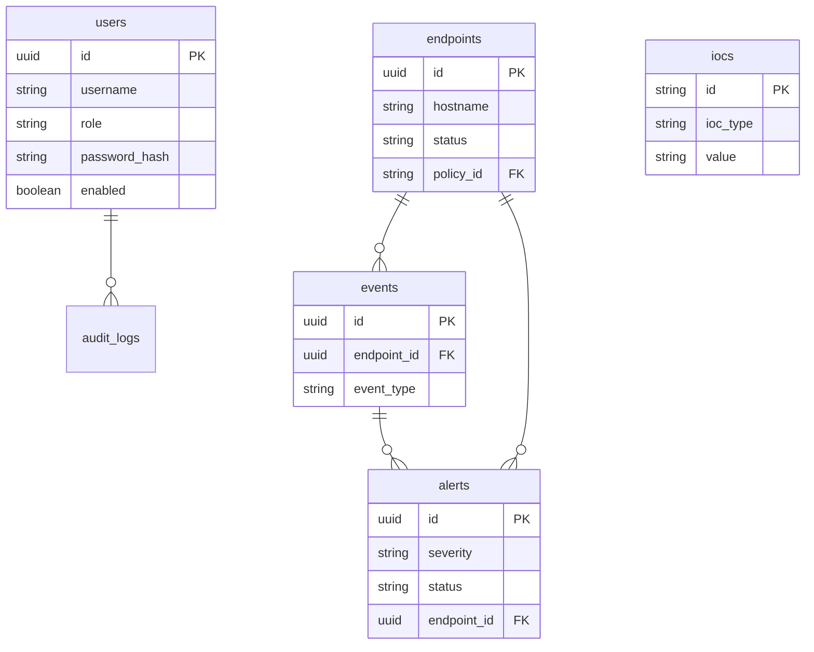

# Monolith Architecture

## Overview



## Component Architecture



## Data Flow: File Scan



## Authentication Flow



## Database Schema



## Communication Ports

| Channel | Transport | Auth | Purpose | Port |
|---------|-----------|------|---------|------|
| REST | HTTPS TLS 1.3 | JWT | Client Backend | 8443 |
| gRPC | HTTP/2 mTLS | Client Cert | Agent Backend | 9443 |
| WebSocket | WSS TLS 1.3 | JWT | Live Events | 7443 |
| Local gRPC | HTTP/2 none | Loopback | Agent Scanner | 50052 |
| IOCTL | Kernel | Process Token | Driver Agent | N/A |

## Directory Layout

```
edr/
  protobuf/       # Cross-component contracts
  shared/         # Shared Rust crate
  backend/        # Management server (Rust/Axum)
  agent/          # Endpoint agent (Rust Windows Service)
  scanner/        # File scanner (Go)
  driver/         # KMDF kernel driver (C)
  # (GUI stripped, to be rewritten from scratch in C#)
  configs/        # TOML config files
  scripts/        # Setup scripts
  docs/           # Documentation
```
